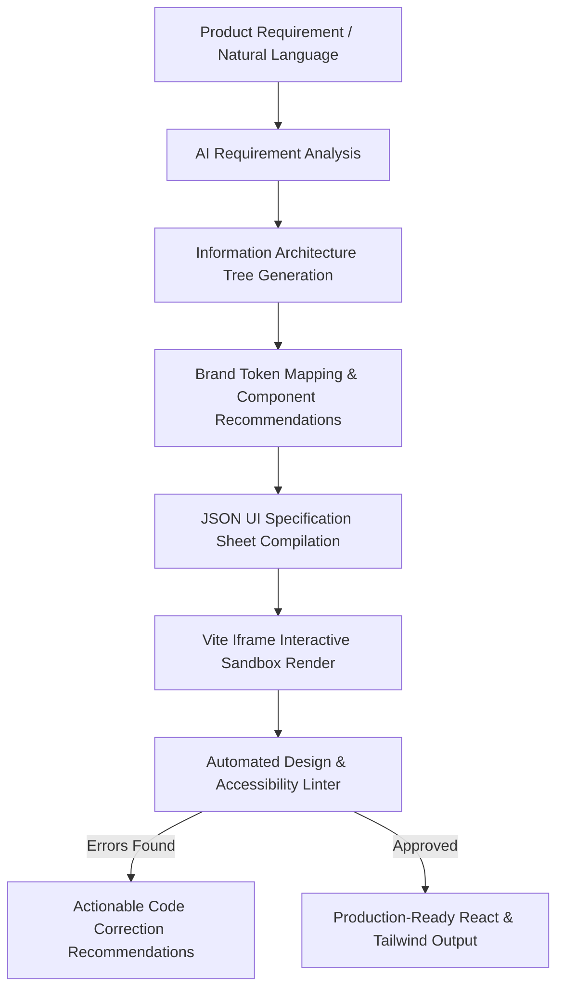
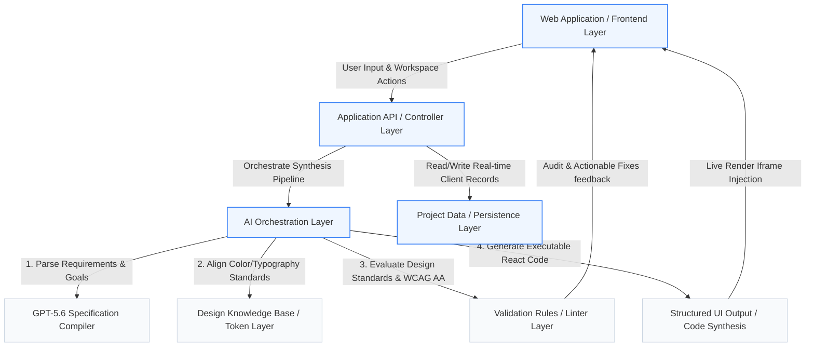

# AI-Native Design System

An AI-native design system that turns product requirements into consistent, production-ready interfaces and code, helping teams design faster, enforce standards, and ship with confidence.


- **Live Submission Sandbox:** [Open AI Studio Live App](https://ais-dev-ob6tahoqngboduitv4nncr-720501515449.asia-southeast1.run.app)
- **GitHub Repository:** `TODO: Add deployed GitHub repository URL`

---

## 1. Overview

Traditional design systems are passive. They live isolated in design files (Figma), separate documentation websites, custom code components, and individual developers' tribal knowledge. This fragmentation leads to:
- High inconsistency when converting product requirements into mockups.
- Redundant design reviews for simple visual compliance.
- Massive drift between the design specification and the active frontend implementation.
- Generic interfaces created by standard AI coding assistants that frequently violate product constraints.

**AI-Native Design System** bridges this gap by turning static design rules and token structures into an **active intelligence layer**. Rather than simply generating random user interfaces, it reads the authorized design guidelines, validates natural language requirements against them, drafts structured schemas, renders high-fidelity interactive sandboxes, and automatically runs design compliance audits (e.g., WCAG AA contrast, spacing rules) over the produced results.

---

## 2. Key Features

The sandbox implements the complete, step-by-step generation and review pipeline for three complex, real-world business scenario presets:
1. **Retail Banking RM Workspace (RM 小助)**: An ultra-polished client management workspace for Relationship Managers, focusing on asset volatility, alerts, and human-in-the-loop CRM writebacks.
2. **SaaS Business Metrics Hub (GrowthPulse)**: A developer-focused growth analytics dashboard with cohort retention charts and automated winback campaign builders.
3. **Adaptive Multi-Step Checkout (FlowCheckout)**: A secure, localized shipping and payment form optimized for friction-free checkouts.

Inside the workspace, you can explore each step of the AI design compiler:

*   **Requirement Analysis**: Translates raw natural language requirements into concrete User Goals, Primary Tasks, and state requirements.
*   **Information Architecture (IA)**: Auto-structures the layout hierarchy tree from main modules down to minor interaction widgets.
*   **Design-System Mapping**: Resolves active brand tokens (typography pairings, colors, curvatures, backdrop blurs) and recommends specific modular components.
*   **UI Specification Sheet**: Synthesizes a machine-readable JSON blueprint defining responsive layouts, valid component states, and validation rules.
*   **Live Sandbox Render**: Renders the **actual, executable React & Tailwind CSS code** into a fully operational interactive interface. You can click, filter tasks, edit talking points, write back log states to CRM, or step through order checkouts.
*   **Compliance & Accessibility Review**: Runs an automated linter calculating WCAG AA contrast ratio constraints, border compliance, and outputs AST code refactoring solutions.

---

## 3. How It Works

1. **Requirement Input**: Product managers or engineers provide product requirements in natural language or choose from three specialized financial/SaaS business presets.
2. **Context Enrichment**: The system ingests the raw prompt alongside the active brand token dictionary (e.g., Apple-style glassmorphism spacing, Cobalt color constraints, font matrices).
3. **Semantic Blueprinting (GPT-5.6)**: The core LLM analyzes tasks and variables to generate a machine-interpretable layout specification sheet.
4. **Code Synthesis (Codex)**: Codex translates the specification blueprint into optimized, component-compliant React and Tailwind CSS markup.
5. **AST Audit & Contrast Linter**: The design linter analyzes the generated AST for compliance with accessibility rules (contrast thresholds, keyboard focus, consistent border-radius tokens) and outputs precise visual code repair suggestions.
6. **Execution & Human-in-the-Loop Logging**: The generated dashboard is loaded into the live iframe sandbox, allowing real-time interaction (e.g., copying AI-generated speech scripts, checking off completed tasks, and logging touchpoints).

---

## 4. Product Workflow

Below is the workflow implemented by the AI-Native Design System pipeline:



---

## 5. System Architecture

The AI-Native Design System is engineered as a robust, layered compilation and feedback platform. Rather than generating ad-hoc user interfaces, it decouples requirements analysis and visual mapping from code compilation, closing the loop with automated compliance audits.

### Architecture Topology (Mermaid Diagram)

The following diagram illustrates the relationship between layers and data flow, tracing from the natural language prompt to the final interactive workspace:



---

### Layer-by-Layer Architectural Breakdown

#### ① Frontend Layer (Web Application)
- **Framework & Tooling**: Built on **React 19**, **TypeScript**, and **Vite** as a high-performance Single Page Application (SPA).
- **Core Layout (`src/App.tsx`)**: Controls the master workspace viewport, horizontal step-by-step pipeline stepper (Step 1 to 6), brand design token catalog, and the interactive compliance reviewer portal.
- **Design Tokens Integration**: Implemented natively via Tailwind utility classes styled strictly according to Apple visual design rules (using `@import "tailwindcss"` inside `src/index.css`), leveraging fonts like **Inter** for descriptions and **JetBrains Mono** for financial telemetry.
- **Micro-Frontends (Sandboxes)**: Integrates isolated components including `BankWorkspace.tsx` (the "RM 小助" financial cockpit) and `PresetShowcase.tsx` (hosting GrowthPulse and FlowCheckout) for zero-bleed demo interactions.

#### ② Application Layer (Application API / Controller)
- **State Orchestration**: Powered by React functional state controllers managing real-time edits to requirements, synchronization across active pipeline steps, and reactive layout adjustments.
- **Vite Integration**: Operates as an integrated client-side routing and state registry. In production, Vite compiles all components into a zero-latency static structure served through containerized ingress.

#### ③ AI Orchestration Layer
- **Sequential Pipeline Compiler**: Structures natural language prompts into a 6-stage semantic pipeline: Requirements Analysis $\rightarrow$ IA Node Structure $\rightarrow$ Design Token Mapping $\rightarrow$ UI Specification compilation $\rightarrow$ Sandbox Code Generation $\rightarrow$ Compliance Audits.
- **Context Enrichment Handler**: Automatically prepends active preset design definitions to downstream reasoning engines to guarantee consistent output boundaries.

#### ④ Design Knowledge Layer (Design Knowledge Base)
- **Token Dictionary Registry (`src/data/mockData.ts`)**: Serves as the single source of truth for design constraints.
- **Brand Rules Serialization**: Holds color matrices (Cobalt Slate `#1D4ED8`, Emerald `#059669`, Canvas background `#F6F8FB`), font pairings (Inter & JetBrains Mono), spatial margins (`p-6`, `gap-4`), border curvature definitions (`rounded-3xl`), and glassmorphism blurs (`backdrop-blur-md`).

#### ⑤ OpenAI Integration
- **Advanced Model Prompts**: Simulated via highly specific system-prompt templates.
- **Dual-Model Specialization**: Coordinates **GPT-5.6** (for complex structural analysis and structured JSON compiling) and **Codex** (for exact React and Tailwind translation), preventing arbitrary inline style overrides or layout breakage.

#### ⑥ Data or Persistence Layer (Project Data)
- **CRM Writeback Engine**: Captures client interactions inside the "RM 小助" dashboard (e.g., ticking off task logs, modifying touchpoints, logging call notes) and commits changes back to local react state.
- **Mock Registry**: Pre-loads extensive customer indices (`BankCustomer`), work item indices (`BankTask`), and campaign parameters to render highly realistic banking business models.

#### ⑦ Validation Layer (Validation Rules & Linter)
- **Accessibility & Token Linter**: An AST-inspired custom review engine running WCAG AA contrast validation.
- **Code Repair Advisor**: Analyzes code structures for failures (e.g., poor text contrast like grey on light yellow), outputs detailed design violations, and proposes ready-to-inject code patches (e.g., exchanging classes with correct brand tokens).

#### ⑧ Deployment Layer
- **Dev-Server Port Alignment**: Configured strictly on **Port 3000** for direct internal reverse proxy ingress routing.
- **Cloud Run Containers**: Pre-packaged to run on serverless container hosts, with HMR disabled to ensure smooth, flick-free visual presentations for shared stakeholders.

---

## 6. Codex & GPT-5.6 Model Integration

Our dual-stage AI architecture leverages state-of-the-art models to separate structural intent from engineering execution:

-   **GPT-5.6 (Reasoning & Spec Compiler)**: Acts as the structural orchestrator. It processes raw product specifications, correlates user goals, structures information architecture hierarchies, maps color/spacing tokens, and compiles the final standardized `UI_SPECIFICATION.json`.
-   **Codex (Frontend Synthesizer)**: Acts as the compiler. It ingests the JSON spec and outputs standard, modular TypeScript React components, applying the appropriate Tailwind utility classes. This prevents the generation of arbitrary CSS rules and preserves design-token alignment.

---

## 7. Installation & Quick Start

To run the AI-Native Design System workspace locally, follow these steps:

### Prerequisites
Ensure you have **Node.js (v18+)** and **npm** installed.

### 1. Clone the Repository
```bash
git clone <TODO: Add GitHub Repository URL>
cd ai-native-design-system
```

### 2. Install Dependencies
```bash
npm install
```

### 3. Start the Local Dev Server
The project is pre-configured to run with Vite. Start the server on port 3000:
```bash
npm run dev
```
Open [http://localhost:3000](http://localhost:3000) in your browser to explore the interactive design workspace.

### 4. Build for Production
To compile and bundle the static frontend build into the `dist` folder:
```bash
npm run build
```

### 5. Run Type Safety Checks
The system implements strict, error-free TypeScript integration. You can run checks with:
```bash
npm run lint
```

---

## 8. Project Architecture

The codebase has been meticulously structured using modular React and TypeScript design principles:

```
├── /src
│   ├── /components
│   │   ├── /agent
│   │   │   └── BankWorkspace.tsx    # "RM 小助" interactive workspace
│   │   └── /cards
│   │       └── PresetShowcase.tsx   # SaaS & Checkout interactive sandbox
│   ├── /data
│   │   └── mockData.ts              # System presets, tokens, and mock records
│   ├── App.tsx                      # Main shell (stepper, token explorer, auditor)
│   ├── types.ts                     # Strict TypeScript interfaces
│   ├── index.css                    # Tailwind CSS system imports
│   └── main.tsx                     # Vite mount point
├── index.html
├── package.json
└── tsconfig.json
```

---

## License

This project is licensed under the Apache License 2.0. See the LICENSE file for details.
